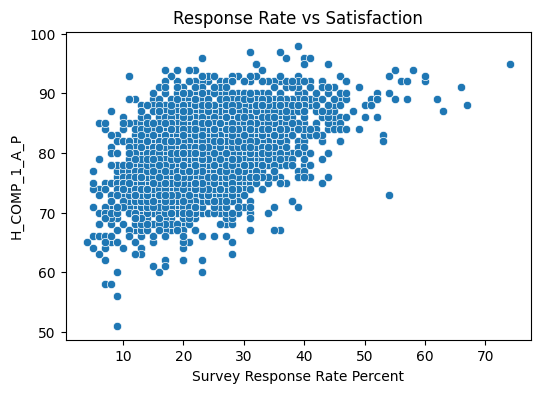
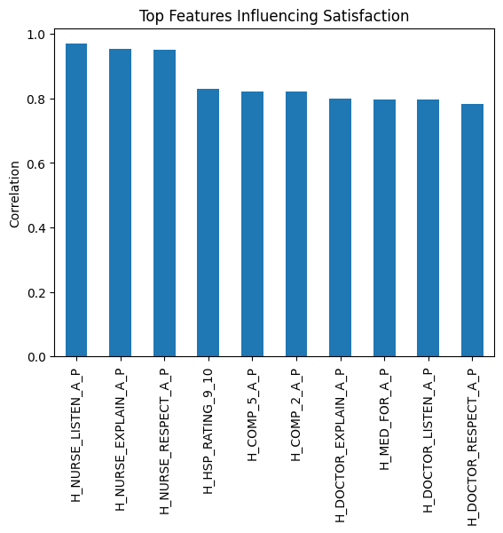
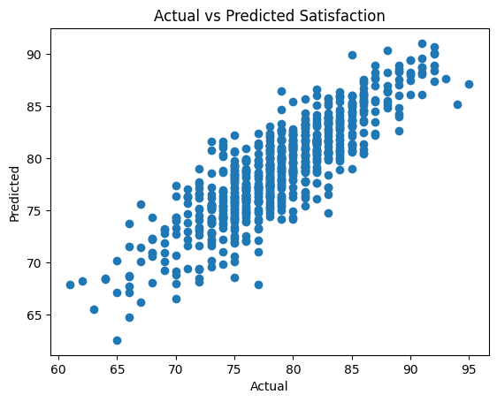

# What Makes Patients Happy in Hospitals? A Data Story

Hospitals collect thousands of patient surveys every year — but what really drives patient satisfaction? Is it the number of surveys collected, the response rate, or something deeper?

In this project, I explored hospital survey data (HCAHPS) to uncover the key factors that influence how patients feel about their care.

---

## Questions I Wanted to Answer

To guide the analysis, I focused on four main questions:

1. How are patient satisfaction scores distributed across hospitals?  
2. Does the number of surveys affect satisfaction?  
3. Does the response rate influence satisfaction?  
4. What factors are most important in determining satisfaction?  

---

## 1. How Satisfied Are Patients Overall?

  

The distribution of patient satisfaction scores is fairly balanced. Most hospitals fall between **65% and 85% satisfaction**, with fewer hospitals at the extremes.

### What This Means
- Most hospitals perform **moderately well**  
- Extremely low or high satisfaction is **rare**  
- There is room for improvement, but no widespread failure  

---

## 2. Do More Surveys Lead to Higher Satisfaction?

  

At first, it might seem logical that hospitals collecting more surveys would have happier patients. However, the data tells a different story.

### Key Insight
- There is **no strong relationship** between the number of surveys and satisfaction  
- Hospitals with fewer surveys show more variation  
- Larger hospitals have more stable scores  

 **Conclusion:** Collecting more surveys improves reliability, but it does not directly increase satisfaction.

---

##  3. Does Response Rate Matter?

This is where things get interesting.

Hospitals with higher response rates tend to have **higher satisfaction scores**.

###  Key Insight
- A **positive relationship** exists between response rate and satisfaction  
- Hospitals that engage patients more tend to score better  

 However:
This does not necessarily mean that increasing response rate causes better satisfaction. It’s possible that better hospitals naturally receive more responses.

---

## 4. What Factors Drive Patient Satisfaction?

The most important factors are clearly related to **communication**, especially from nurses.

Top drivers include:
- Nurses listening carefully  
- Nurses explaining things clearly  
- Nurses treating patients with respect  

### Key Insight
**Communication is the strongest driver of patient satisfaction**

Hospitals that perform well in communication also perform well overall.

---

## Can We Predict Patient Satisfaction?

I built a machine learning model to predict satisfaction scores based on hospital characteristics.

###  Model Results
- The model explains about **74% of satisfaction variation**
- Predictions closely follow actual values

This shows that hospital survey data contains meaningful patterns that can be used to estimate performance.

---

## A Real-World Scenario

Imagine a hospital where:
- 50% of patients give high ratings (9–10)
- Response rate is moderate (~25%)
- Survey participation is strong

The model predicts a **high satisfaction score**, suggesting that strong ratings and engagement lead to better outcomes.

---

##  Final Takeaway

The biggest lesson from this analysis is simple:

 **Patient satisfaction is driven more by human interaction than by numbers.**

- More surveys don’t increase satisfaction  
- Response rate helps—but may reflect existing quality  
- **Communication is the key factor**  

Hospitals that focus on **listening, explaining, and respecting patients** are the ones that achieve the highest satisfaction.

---

## Final Thought

Improving healthcare doesn’t always require new technology or more data. Sometimes, the most powerful improvements come from something much simpler:

 Better communication between people.

---
``
